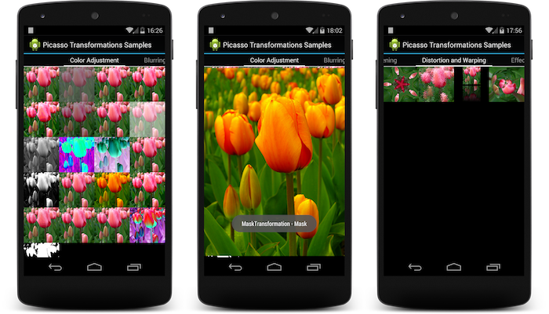

Picasso Transformations
=======================

A transformation library providing a variety of image transformations for [Picasso](https://github.com/square/picasso).

What's Included
---------------

A variety of filters

 * Color Adjustments
 * Blurring / Sharpening
 * Distortion / Warping
 * Effects
 * Edge Detection

Transformation Categories

* [JH Labs Image Filters](http://www.jhlabs.com/ip/filters/index.html)
* RenderScript Transformations

Building
--------

This jar is not yet available on Maven Central. You must clone the repository and build the project.

### Requirements to Build

1. A defined ANDROID_HOME environment variable
2. Android API 19 (SDK Manager)
3. Android Support Repository (SDK Manager)
4. [Maven Android SDK Deployer](https://github.com/mosabua/maven-android-sdk-deployer)
5. Maven 3.1.1+

### Maven Android SDK Deployer

Documenation: [Maven Android SDK Deployer](https://github.com/mosabua/maven-android-sdk-deployer)

    git clone git://github.com/mosabua/maven-android-sdk-deployer.git
    cd maven-android-sdk-deployer/platforms
    mvn install -P 4.4

### Build

You can build `picasso-transformations` as follows:

    git clone https://github.com/TannerPerrien/picasso-transformations
    cd picasso-transformations
    mvn package

Copy `picasso-transformations-x.x.x.jar` from the target directory of the `picasso-transformations` module into your project.

Sample App
----------

Install the Sample app to see the filters in action. Long press an image to see a Toast describing the filter.

### Install Sample App

You can install the sample app after you build the project.

    adb install picasso-transformations-sample/target/picasso-transformations-sample-1.0.0.apk

License
-------

    Copyright (C) 2014 Tanner Perrien

    Licensed under the Apache License, Version 2.0 (the "License");
    you may not use this file except in compliance with the License.
    You may obtain a copy of the License at

       http://www.apache.org/licenses/LICENSE-2.0

    Unless required by applicable law or agreed to in writing, software
    distributed under the License is distributed on an "AS IS" BASIS,
    WITHOUT WARRANTIES OR CONDITIONS OF ANY KIND, either express or implied.
    See the License for the specific language governing permissions and
    limitations under the License.
